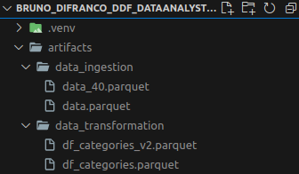
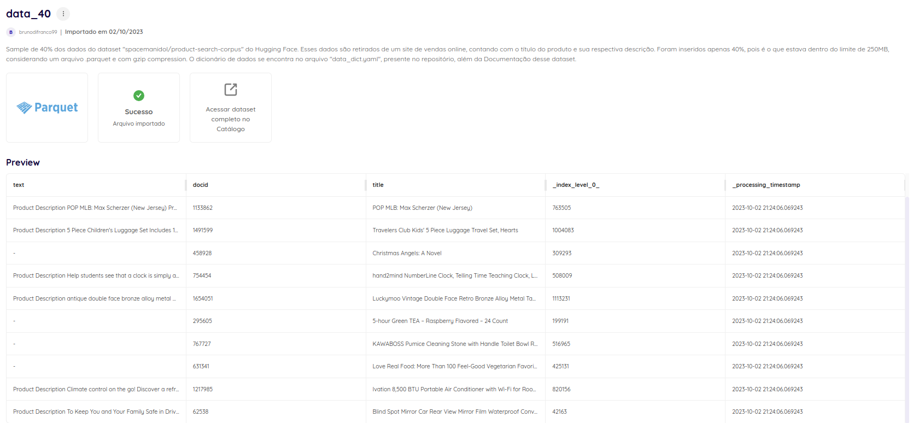

# **Item 1 - Sobre Storytelling e Apresentação**

## Problema

<p align="justify"> Seu cliente, uma grande empresa de e-commerce, está com um projeto de um novo aplicativo de dados em produção. Após a primeira reunião com nossa equipe de vendas, você deve fornecer uma solução técnica que atenda às exigências e se encaixe na arquitetura deles. Você deve mostrar, com base nos seus estudos sobre a Documentação da Dadosfera, a viabilidade de substituirmos essa solução. </p>

Essa arquitetura deve ser a base de uma nova Plataforma de Dados, com o objetivo de fornecer:

- Modelos de IA para melhorar a experiência de compra dos clientes

Sua apresentação deve ter, pelo menos, 3 destas respostas:

- Principal problema a ser resolvido
- Diagrama da solução com Dadosfera, substituindo parcial ou totalmente a arquitetura desenhada acima. Como a Dadosfera é uma solução tecnicamente mais viável e/ou mais barata
- Oportunidades e ganhos futuros de se adotar a Dadosfera, frente à solução atual

## Solução

- [Vídeo no YouTube](https://youtu.be/DZcXUc6LzHE) com a apresentação.

- Diagrama:


# **Item  2 - Sobre a Dadosfera**

## Problema

<p align="justify"> Parabéns! Conseguimos convencer o cliente de usar a Dadosfera. Agora, precisamos iniciar o projeto de implementação da nossa solução para um case específico. Vamos iniciar com o carregamento e posterior análise descritiva dos dados de produtos de um site para análise. Os dados estão disponíveis neste site. Toda a documentação sobre o dataset também esta disponível. </p>

<p align="justify"> Usando os seus conhecimentos da documentação da Dadosfera, faça a carga desse dataset, catalogue-o com as informações mais relevantes, seguindo boas práticas de Dicionário de Dados. </p>

## Solução

Extração dos dados com o script `extract.py`, com o auxílio das funcões criadas em `utils/common.py`, além do arquivo de configuração `config.yaml`. Isso permite o carregamento e salvamento local dos dados na pasta `artifacts`, que fica escondida, por conta do `.gitignore`, porém abaixo segue print desses dados salvos, além do terminal quando executamos o `extract.py`. 




O arquivo é salvo em `.parquet`, para economia de espaço. Além disso, também é possível avaliar o processo feito, através do notebook `research/30-09-2023-extract.ipynb`, contendo um sample dos dados, além de informações básicas como tipos de dados, dados faltantes, tamanho dos dados, etc. 

O arquivo foi carregado para a plataforma da Dadosfera também: 


Ainda, o **dicionário de dados** está presente no arquivo `data_dict.yaml` (e na Documentação do arquivo carregado na Dadosfera), com diversas informações referentes aos dados extraídos. Por fim, há um arquivo somente para descrever os tipos de dados, nomeado `schema.yaml`.

# **Item 3 - Sobre GenAI e LLMs**

## Problema

<p align="justify"> O Dataset disponibilizado tem 2 colunas de texto, uma de título e outra de descrição. Utilize um LLM - como  ChatGPT ou Claude - para criar features dos produtos que serão úteis para análise. </p>

## Solução

- Decidi utilizar um modelo do mesmo autor que fez o upload dos dados no HuggingFace, e segundo a tag desse [modelo](https://huggingface.co/spacemanidol/trec-product-search-e5-small-v2) ele é feito para "Feature Extraction", que é exatamente o objetivo nesse caso.
  
- Com um pouco de pesquisa é possível perceber que o dataset foi extraído da Amazon, por isso utilizei as seguintes categorias possíveis de produtos para serem utilizadas no prompt do modelo:

  - "Health, Beauty",
  - "Electronics, Computers",
  - "Home and Kitchen",
  - "Clothing",
  - "Sports",
  - "Office",
  - "Movies, Music",
  - "Books"   
  
- Obs: Me limitei ao uso da LLM para extrair as categorias de cada produto, e não features específicas para cada produto, pois:
  - Há uma dificuldade computacional de executar essa ação em tão pouco tempo, com apenas uma placa de vídeo RTX 3050 4GB, que é o que disponho no momento.
  - Há uma limitação de recursos em termos de modelo para executar tal ação, pois as LLM's que conseguiriam fazer esse processo de forma satisfatória seriam um gpt-3.5-turbo ou gpt-4, ou modelos parecidos, que não são gratuitos. 

- O notebook de testes e desenvolvimento utilizado para esse item é `research/01-10-2023-llm.ipynb`. A pipeline completa e modularizada está em `llm_pipeline.py`, que novamente contou com o auxílio do arquivo `config.yaml`. Finalmente, o arquivo é salvo no disco. Além disso, também subi o arquivo na plataforma da Dadosfera, com o nome `df_categories_v2.parquet`, lá é encontrada a descrição e dicionário de dados na Documentação.
    
*Com mais tempo seria possível incrementar a solução sem necessariamente ter que gastar com um modelo pago, fazendo, por exemplo, o seguinte:*

- *Classificando manualmente exemplos para incrementar o prompt.*
- *Utilizar PEFT (Parameter Efficient Fine-Tuning) que busca fazer o fine tuning apenas dos parâmetros "mais relevantes" (entre muitas aspas) do LLM, como 1% dos parâmetros mais relevantes, por exemplo, ao invés de aplicar o fine tuning em todos os parâmetros.*

# **Item  4 - Sobre SQL e Python**

## Problema

<p align="justify"> Com as features extraídas pelo LLM dentro da Dadosfera, precisamos ir para a etapa de geração de valor. Utilize as mesmas credenciais para acessar nosso módulo de Visualização. Observe que você precisa utilizar o identificador (ID) da tabela para encontrá-la no nosso módulo de Visualização. Crie uma Coleção com o formato "<nome> <sobrenome> - <mes_ano>". </p>

<p align="justify"> Crie uma visualização de dados que mostre uma análise das categorias dos produtos. Salve a Query SQL utilizada e também o print do resultado da query no documento markdown deste teste. </p>

## Solução
```
SELECT
    category,
    COUNT(*) AS amount_of_products
FROM
    TB__BJIRM1__DF_CATEGORIES_V2
GROUP BY
    category
```

**Resultado da Query:**


**Visualização Escolhida:**


O Dashbord está disponível em **Testes Técnicos - Analista de Dados/Bruno Di Franco - 102023**, dentro do Metabase na plataforma de Dadosfera.

# **Item  5 - Sobre Data Apps**

## Problema

<p align="justify"> Agora você tem que criar um Data App utilizando Streamlit para explorar os dados anteriores. Para criar um Data App, acesse nosso módulo de inteligência e siga este guia na nossa documentação. Sugestões de análises: </p>

- Similaridade entre produtos
- Tensorboard - Similaridade entre produtos
- EDA - usando GPT

**Obs: Não foi possível logar no Módulo de Inteligência na Dadosfera (o botão de login simplesmente parece não funcionar). Por isso, fiz o App no Streamlit manualmente, cujo repositório está disponível [aqui]().**
## Solução
 A ideia de App foi fazer um embedding das palavras (tokens) mais comuns utilizadas no título e descrição dos produtos no nosso dataset, utilizando um modelo Word2Vec. Depois, é possível visualizar esse resultado com um t-SNE, que é um método de redução de dimensionalidade (parecido com UMAP). Isso é útil para termos uma noção de similaridades entre objetos. O estudo desse item está presente em `research/03-10-2023-streamlit-prep.ipynb`, e foi desenvolvido com base no [notebook](https://www.kaggle.com/code/jeffd23/visualizing-word-vectors-with-t-sne/notebook) do Kaggle do usuário Jeff Delaney, incluindo o código, que foi adaptado desse notebook.

 Obs: O modelo de Word2Vec utilizado está em `models/word_embedding`.

<div align="center">

|         **Clique abaixo para acessar o App do Streamlit:**        |
|:------------------------:|
|         [](https://star-jeans.streamlit.app/)
</div>

## Extras:
### Organização do Projeto

    ├── LICENSE
    ├── README.md          <- README do projeto, com toda a documentação sobre o mesmo
    ├── .venv              <- Arquivos do ambiente virtual (no repositório remoto está escondido)
    │
    ├── .artifacts
    │   ├── data_ingestion      <- Arquivos .parquet extraídos (no repositório remoto está escondido)
    │   └── data_transformation <- Arquivos .parquet com as categorias dos produtos (no repositório remoto está escondido)
    │
    ├── config           <- Pasta com o arquivo .yaml com as configurações do repositório
    │        
    ├── images           <- Imagens usadas no README do projeto
    │
    ├── models           <- Modelos de Embedding
    │
    ├── research         <- Jupyter notebooks, utilizados no desenvolvimento do projeto
    │
    ├── utils            <- Pasta com arquivos de utilidade
    │   └── common       <- Funções auxiliares
    │
    ├── requirements.txt <- Bibliotecas necessárias no projeto `pip freeze > requirements.txt`
    │
    ├── data_dict.yaml   <- Dicionário de dados
    ├── extract.py       <- Script de extração de arquivos
    ├── llm_pipeline.py  <- Pipeline do modelo LLM
    ├── schema.yaml      <- Dicionário de dados

### Como reproduzir o que foi feito?

Clonar o repositório com:

```
git clone https://github.com/brunodifranco/BRUNO_DIFRANCO_DDF_DATAANALYST_102023.git
```

Criar um ambiente virtal. Primeiro checar se está instalado:

```
virtualenv --version
```
Se não tiver, instalar com:

```
pip install virtualenv
```

Agora criar o ambiente com o nome `.venv`, utilizando:

```
virtualenv .venv
```

Por fim, ativamos o ambiente virtual com:

```
source .venv/bin/activate
```

Instalar as bibliotecas necessárias:

```
pip install -r requirements.txt
```

Agora podemos executar o script desejado, como o extract.py, por exemplo:

```
python extract.py
```

### Como melhorar a solução?

- Fazer a extração de dados (arquivo `extract.py`) de modo que suba para um banco de dados como o Snowflake. Após, conseguiríamos captar esses dados diretamente desse banco de dados e utilizar a pipeline `llm_pipeline.py`. Por fim, poderíamos utilizar *Docker* e *MLFlow*, para utilizar containers e monitorar o desenvolvimento da aplicação.

- Com uma escalabilidade maior do modelo (maior volume de dados) seria necessário a conversão do framework de Pandas para um processamento em paralelo, como o *PySpark*, por exemplo.

- Conforme já citado, a questão da extração de features com a LLM poderia ser melhorada com:
  - Classificar manualmente exemplos para incrementar o prompt.
  - Utilizar PEFT (Parameter Efficient Fine-Tuning) que busca fazer o fine tuning apenas dos parâmetros "mais relevantes" (entre muitas aspas) do LLM, como 1% dos parâmetros mais relevantes, por exemplo, ao invés de aplicar o fine tuning em todos os parâmetros.


